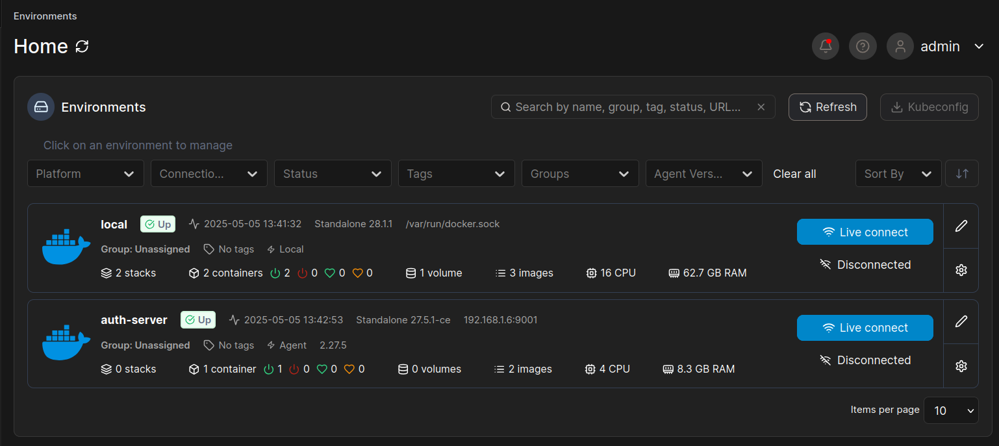

# Part 9

*Date: 2025-05-04*

## Setup Auth Server (Open Suse Leap Micro)

### Install Portainer Agent

```bash
sudo transactional-update
sudo transactional-update pkg install docker docker-compose docker-compose-switch && reboot
systemctl disable --now transactional-update.timer && reboot
systemctl enable --now docker.service
sudo usermod -aG docker $USER
newgrp docker

docker run -d -p 9001:9001 --name portainer_agent --restart=always -v /var/run/docker.sock:/var/run/docker.sock -v /var/lib/docker/volumes:/var/lib/docker/volumes -v /:/host portainer/agent:latest
```
## Result




### Install Vault Warden Server

```bash
docker pull vaultwarden/server:latest
docker run --detach --name vaultwarden --env DOMAIN="https://vault.duksosleepy.dev" --volume ~/.vaultwarden/containers_data/server/data:/data/ --restart unless-stopped --publish 80:80 vaultwarden/server:latest
```


```bash
nano ~/docker-services/caddy/config/Caddyfile
vault.duksosleepy.dev {
    tls {
        dns cloudflare {env.CLOUDFLARE_API_TOKEN}
    }

    reverse_proxy 192.168.1.6:443 {
        header_up Host {host}
    }

    header {
        Strict-Transport-Security "max-age=31536000; includeSubDomains; preload"
        X-Content-Type-Options "nosniff"
        X-Frame-Options "SAMEORIGIN"
        Referrer-Policy "strict-origin-when-cross-origin"
        -Server
    }

    log {
        output file /data/logs/vault-access.log {
            roll_size 10MB
            roll_keep 5
        }
        format json
    }
}
```
