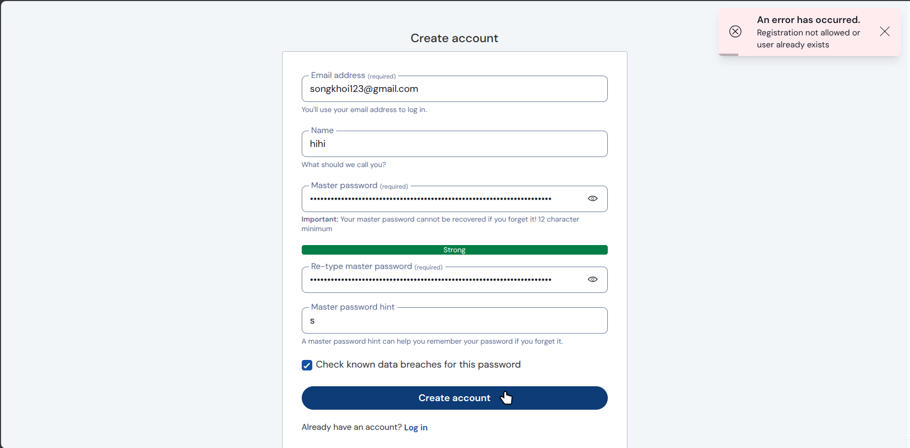

# Part 9

*Date: 2025-05-04*

## Setup Auth Server (Open Suse Leap Micro)

### Install Portainer Agent

```bash
sudo transactional-update
sudo transactional-update pkg install docker docker-compose docker-compose-switch && reboot
systemctl disable --now transactional-update.timer && reboot
systemctl enable --now docker.service
sudo usermod -aG docker $USER
newgrp docker

docker run -d -p 9001:9001 --name portainer_agent --restart=always -v /var/run/docker.sock:/var/run/docker.sock -v /var/lib/docker/volumes:/var/lib/docker/volumes -v /:/host portainer/agent:latest
```
## Result


### Install Vault Warden Server

```bash
docker pull vaultwarden/server:latest
docker run --detach --name vaultwarden --env DOMAIN="https://vault.duksosleepy.dev" -e WEBSOCKET_ENABLED=true -e ROCKET_ADDRESS=0.0.0.0 -e ROCKET_PORT=80 --volume ~/.vaultwarden/containers_data/server/data:/data/ --restart on-failure -p 192.168.1.6:80:80 -p 192.168.1.6:3012:3012 vaultwarden/server:latest
```

## After create account, you MUST disable signup for guest
```bash
sudo docker stop vaultwarden
sudo docker rm vaultwarden
docker run --detach --name vaultwarden --env DOMAIN="https://vault.duksosleepy.dev" -e WEBSOCKET_ENABLED=true -e SIGNUPS_ALLOWED=false -e ROCKET_ADDRESS=0.0.0.0 -e ROCKET_PORT=80 --volume ~/.vaultwarden/containers_data/server/data:/data/ --restart on-failure -p 192.168.1.6:80:80 -p 192.168.1.6:3012:3012 vaultwarden/server:latest
```


```bash
nano ~/docker-services/caddy/config/Caddyfile
vault.duksosleepy.dev {
    encode gzip
    tls {
        dns cloudflare {env.CLOUDFLARE_API_TOKEN}
    }

    @websockets {
        header Connection *Upgrade*
        header Upgrade websocket
    }

    reverse_proxy /notifications/hub/negotiate 192.168.1.6:80

    reverse_proxy /notifications/hub 192.168.1.6:3012

    reverse_proxy @websockets 192.168.1.6:3012

    reverse_proxy 192.168.1.6:80 {
        header_up X-Real-IP {remote_host}
        header_up X-Forwarded-For {remote_host}
        header_up X-Forwarded-Proto https
        header_up X-Forwarded-Host {host}
        header_up Host {host}
        transport http {
            keepalive 30s
            keepalive_idle_conns 10
        }
    }
}
```
